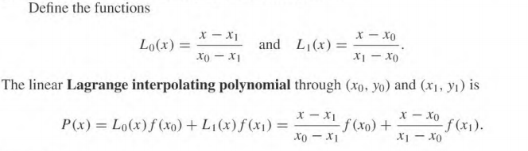
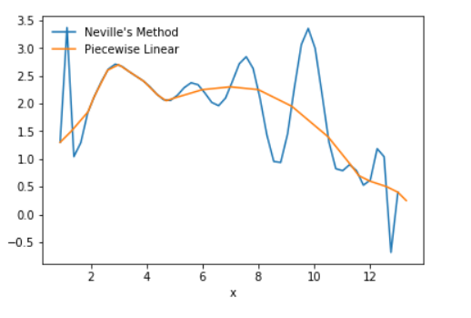
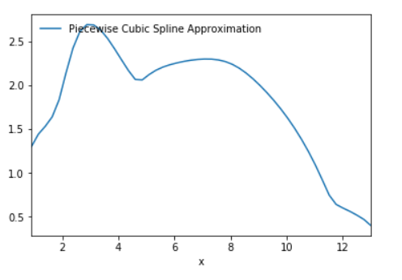

### Interpolation and Polynomial Approximation

#### Abstract

​	This paper is about interpolation in general. It will discuss the different between each interpolation method. When to use one over another. What problem each interpolation method solves and of course, help readers gain a better understanding of interpolation in general.

#### Introduction

​	The most useful and well-known kind of functions mapping the set of real number onto itself is the polynomials. These polynomials uniformly approximate continuous functions. When given a function defined and continuous on a closed and bounded interval, there exist another polynomial that  approximates the given function, or is considered to be "close". 

#### Weierstrass Approximation Theorem

​	Suppose that *f* is defined and continuous on the set closed set [a,b]. For any ε > 0, there exists a polynomial *P*(x), defined on a [a,b], with the property that

|*f*(x) - *P*(x)| < ε, for all *x* in [a,b].

A simple explanation for the theorem above is that there exist a polynomial *P*(x) "close" to the given function *f* (x). This function *P*(x) is an approximation.


#### Taylor Series

​	Interpolation is a way of approximating the true underlying function *f*(x) with some interpolating function *P*(x), but Taylors expansion is also an approximation method. Why use Interpolation then? both sound similar. The main difference is that a Taylor expansion approximates a function around *a point*; in addition, they concentrate their accuracy near that point. This means that as you moved farer and farer from the  specific point it becomes less accurate. A good approximating polynomial needs to be relatively accurate over the entire interval. 

```python
#parameter: x returns f(x) 
def TaylorExp(x, n):
    y = 0
    for i in range(n):
        numerator = x**i
        denominator = math.factorial(i)
        y += numerator/denominator
    return y
```

​	

​	The line label as **e<sup>x</sup>** was given a n size of **100** compare to the other lines in the graph, **e<sup>x</sup>** is the more accurate. That's the point, better approximations are obtained for *f*(x) if higher degree Taylor polynomials are used, however, this isn't true for all functions. In conclusion, Taylor series is used for the approximation at a single number, as a result; these polynomials will give inaccurate approximations as we move away from that single number. 

#### Lagrange Interpolation

##### Lagrange Linear Interpolation

​	Lets say we take a sample of just two data points. The two points are given by the coordinates (x<sub>0</sub>,y<sub>0</sub>) and (x<sub>1</sub>,y<sub>1</sub>), the linear interpolation of these two points is a straight line between these points.  



Linear interpolation is one of the more simpler methods, but obviously isn't very accurate. 


Let's use the function **e<sup>x</sup>** as an example. Lets pretend we only have two data points (6, 403.4287) and (8, 2980.9579). We can use linear interpolation to approximate the *f*(x) where x =7.

```python
def linearInterpolation(x, x0, x1,function):
    lagrange0 = (x-x1)/(x0-x1)
    lagrange1 = (x-x0)/(x1-x0)
    return lagrange0*function(x0) + lagrange1*function(x1)
```


In the graph above the blue line represents the true function **e<sup>x</sup>**. Using only two data points we denote the function we want to interpolate by g. We would approximate the function *f*(x) by *g*(x). Where *g*(x) lies between the function *f*(a) and *f*(b).  The absolute error and relative error is high when we which to approximate *f*(7) using *g*(7), however; what it lacks in accuracy it makes up for in simplicity. Lets see what happens if the two data points we have are far come each other. 


The graph above shows a linear interpolation where (0,*f*(0)) and (10,*f*(10)) are known for the blue line. As you can imagine two data points that are far from each other won't produce accurate results with linear interpolation. For the best accuracy possible, it helpful to have two data points relativity close to one another.  Looking at the orange line it looks like if we took more and more samples we'll get a more accurate line. The orange line uses the x values from the set of real number {0,1,2,3,4,5,6,7,8,9,10}, where the value y = *f*(x). 

##### Lagrange Interpolation Polynomial


​	We are generalizing the concept of linear interpolation. Which brings me back to my previous point, the more samples taken from the data the more accurate the approximation.  Here is the python implementation of Lagrange Interpolation Polynomial. 

``` python
def lagrangeInterpolatingPolynomial(x, dataPoints, function):
    approximatedValue = 0
    for i in dataPoints:
        lagrangeValue = 1
        for j in dataPoints:
            if (i != j):
                numerator = (x - j)
                denominator = (i - j)
                lagrangeValue *= (numerator/denominator)
        approximatedValue += (function(i)*lagrangeValue)
    return approximatedValue
```

​	Lets take a look at the function cos(x), for this example the known data points are for each element x in the set {0,1,2,3,4,5,6,7,8,9,10} where y = *f*(x). I decided to approximate each value over a specified interval which is (0,10). 

```python
dataPoints = [0,1,2,3,4,5,6,7,8,9,10]
x = linspace(0,10)
y = getAllLagrangeInterpolatingPolynomial(x, dataPoints, math.cos)
```

Here are the results. 


Based on the graph alone, the approximation of the function cos(x) seems pretty close. 


The full chart is available in the source code provided, based on the chart the error is kept to minimal takes to the many samples taken. Now lets see what happens if we take remove some samples. To see how the interpolating function behaves, change the array named data points. 

```python
dataPoints = [0,1,2,3,4,5,6,7,8,9,10]
```

Lets try taking out all the odd x values. 

```python
dataPoints = [0,2,4,6,8,10]
x = linspace(0,10)
y = getAllLagrangeInterpolatingPolynomial(x, dataPoints, math.cos)
```


​	Based on the graph above when even x values are known the approximation is quite close; however, when odd the interpolating function loses accuracy. It seems that between the interval of [8,10] there's seems to be a huge gap. Another observation about the interpolating function I found was that if there are no known data points ahead. Based on the slopes current trajectory, the interpolating function will continue on that trajectory on an increasing or decreasing rate depending on the slope of the previously known data point. 

​	I decided to try to approximate the function e<sup>x</sup> with it's positive slope, to see if my suspensions about the interpolating function's slope was correct. 

``` python
dataPoints = [0,1,2,3,4,5]
x = linspace(0,10)
y = getAllLagrangeInterpolatingPolynomial(x, dataPoints, exp)
```


Everything pass the x value 5 is unknown, and the interpolating function does it's best to approximate the function e<sup>x</sup>. At x=5 and *f*(5), the slope is slowly increasing and as we go pass 5 the rate of the slope is positively increasing; based on that, It seems that the last known true slope determines the slope of future interpolating function. 


As you can see the absolute error grows rapidly when x > 5 and is approaching 10. If we try to approximate higher x values, it'll be a pretty useless approximation.  


For fun, I decided to see what the interpolating function will do pass the x when x = 10. 

​	In conclusions, the Lagrange Interpolation Polynomial is useful if you have a big enough sample. It does a poor job if the sample size is small. It can't predict the future. The last known data point will determine if the slope increases or decreases, but that is it. The true slope could be doing the exact opposite of the what the interpolation function approximated. 

##### Lagrange Polynomial Approximation Error


​	Looking at the error term above, it looks like the error is minimize if the value you are approximating is close to one of the known data points. This is evident based on what is seen when approximating cosine with Lagrange polynomial. 


​	As you can see when x is moving away from 8 the approximation error grows, but as x approaches 10 the error is minimized. So when Lagrange polynomial approximation its best to take a large sample of data. That way you can minimized the error throughout the whole interval. 

#### Neville's Method

​	Previously with Lagrange polynomial approximating, it would interpolate the data. In that case an explicit representation isn't needed, just the values of the polynomial at specified points. This is where Neville's Method comes in. Neville's method uses a programming technique known as dynamic programming. Before Lagrange polynomial would calculate the first approximation and then the second approximation. However, calculating the first approximation doesn't lessen the work for calculating the second approximation. 


​	The chart above shows Neville's Methods matrix. The first column is the known data points. The next columns will perform the calculations using the previous columns. The next columns will use the previous columns to lessen the work for the current column. 

```python
def nevillesMethod(xValues, yValues,x):
    sizeN = len(xValues)
    q = np.zeros((sizeN,sizeN))
    for i in range(len(yValues)):
        q[i][0] = yValues[i]

    #Neville's method...
    for i in range(1,sizeN):
        for j in range(1, i+1):
            numerator = ((x - xValues[i - j])*(q[i][j - 1]) - (x - xValues[i])*(q[i - 1][j - 1]))
            demoninator = (xValues[i] - xValues[i - j])
            q[i][j] =  numerator/ demoninator 
    return q[sizeN-1][sizeN-1]
```


Neville's method gives us the same result as Lagrange polynomial, but with the added help of dynamic programming. The disadvantage is that, Neville's method only uses half the matrix, thus there is wasted memory.

#### Cubic Spline Interpolation

​	Throughout my project, I kept running into these wild oscillations when interpolating data. It turns out that high-degree polynomials can oscillate erratically; minor fluctuation over a small portion of the interval can cause large fluctuations over the entire range. 

##### Piecewise-Polynomial Approximation

​	The simplest Interpolation is the linear interpolation method. Which is the linear interpolation between two points; however, what about linear interpolation between multiple points.  The piecewise- linear interpolation consists of joining a set of data points {(x0,f(x0)), (x1,f(x1))...(xn-1,f(xn-1))} by a series of straight lines. 


​	The draw back to the piecewise polynomial approximation is that there is no differentiability at the end points of each subinterval. So when representing the interpolating function graphically, the function isn't "smooth". Smoothness in a interpolating function is a requirement, meaning that the function approximating function MUST be continuously differentiable. 

##### Cubic Spline

​	Another piecewise polynomial approximation is the cubic spline. Its somewhat similar to linear piecewise approximation in that you use sub intervals. Cubic spline interpolation uses cubic polynomials between pair of nodes. Generally the cubic spline ensure that the interpolant is continuously differentiable on the interval; in addition, has a continuous second derivative. What does that mean? To be continuously differentiable is when taking the first derivative limit from both sides for a specific point will lead to the same limit. Taking the second derivative limit from both sides for a specific point will lead to the same result i.e local maximum or local minimum. That way the end points will give us that smooth curve we have been looking for. 



​	As you can see when using Neville's method it osculates wildly. Piecewise linear approximation doesn't give us that smooth curve we want. 



​	When applying cubic spline we get a much nicer more smooth graphical representation. 


​	When applying it to cosine function you can see a much greater fit for cosine. The problem is cubic spline is difficult to implement. So It seems that as long as you gather  a large enough sample size, for Lagrange polynomial you can minizines the error, but Cubic spline might be a better option if you're sample size isn't large enough. 

#### Conculsion

​	Lagrange linear approximation is the easiest, but not very accurate. Lagrange Polynomial approximation is great if a large enough sample is collected.  This will minimized the error and the wild oscillations. Neville's method will give the same results as Lagrange with the addition of dynamic programming since an explicit representation of the polynomial isn't needed. The wild oscillations will be solved with the Piecewise linear approximation, but it doesn't give the "smooth" look. The Piecewise cubic spline approximation will approximate the function with great accurately and remove those wild oscillations. 