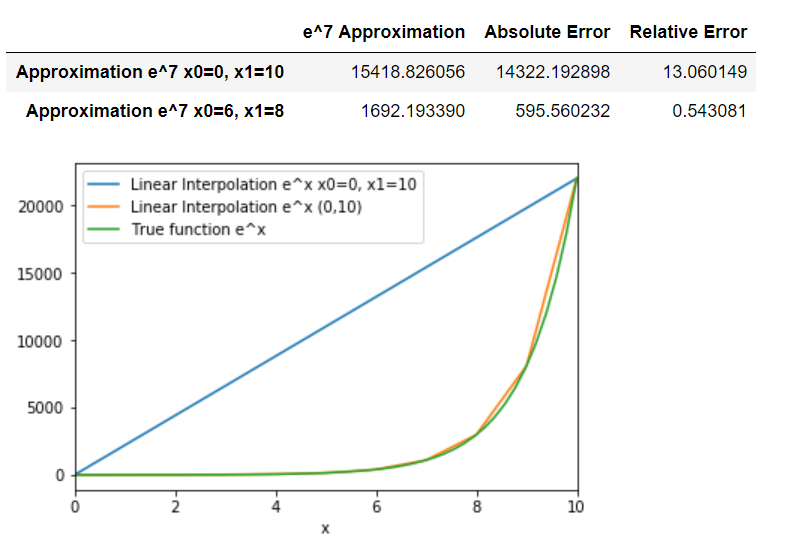
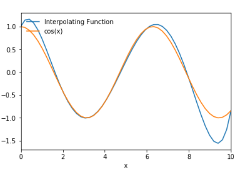
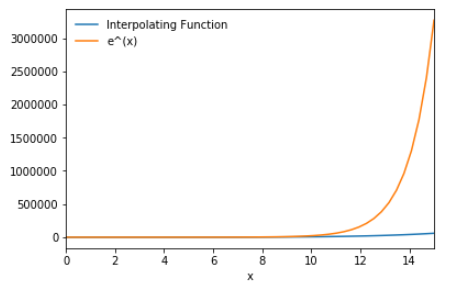

### Interpolation and Polynomial Approximation

​	The most useful and well-known kind of functions mapping the set of real number onto itself is the polynomials. These polynomials uniformly approximate continuous functions. When given a function defined and continuous on a closed and bounded interval, there exist another polynomial that  approximates the given function, or is considered to be "close". 

#### Weierstrass Approximation Theorem

​	Suppose that *f* is defined and continuous on the set closed set [a,b]. For any ε > 0, there exists a polynomial *P*(x), defined on a [a,b], with the property that

|*f*(x) - *P*(x)| < ε, for all *x* in [a,b].

A simple explanation for the theorem above is that there exist a polynomial *P*(x) "close" to the given function *f* (x). This function *P*(x) is an approximation.


#### Taylor Series

​	Interpolation is a way of approximating the true underlying function *f*(x) with some interpolating function *P*(x), but Taylors expansion is also an approximation method. Why use Interpolation then? both sound similar. The main difference is that a Taylor expansion approximates a function around *a point*; in addition, they concentrate their accuracy near that point. This means that as you moved farer and farer from the  specific point it becomes less accurate. A good approximating polynomial needs to be relatively accurate over the entire interval. 

```python
import math
import pandas as pd
import numpy as np
from pylab import *

#parameter: x returns f(x) 
def TaylorExp(x, n):
    y = 0
    for i in range(n):
        numerator = x**i
        denominator = math.factorial(i)
        y += numerator/denominator
    return y
        
def getAllTaylorExp(x, n):
    y = []
    for i in x:
        y.append(TaylorExp(i,n))
    return y

x = linspace(0,10)
P0 = getAllTaylorExp(x,1)
P1 = getAllTaylorExp(x,2)
P2 = getAllTaylorExp(x,3)
P3 = getAllTaylorExp(x,4)
P4 = getAllTaylorExp(x,5)
ex = getAllTaylorExp(x,100)
DF0=pd.DataFrame({'x':x,'P(0)':P0})
DF1=pd.DataFrame({'x':x,'P(1)':P1})
DF2=pd.DataFrame({'x':x,'P(2)':P2})
DF3=pd.DataFrame({'x':x,'P(3)':P3})
DF4=pd.DataFrame({'x':x,'e^x':P4})


ax = DF0.plot(x='x',y='P(0)')
DF1.plot(x='x',y='P(1)',ax=ax)
DF2.plot(x='x',y='P(2)',ax=ax)
DF3.plot(x='x',y='P(3)',ax=ax)
DF4.plot(x='x',y='e^x',ax=ax)

```

​	

​	The line label as **e<sup>x</sup>** was given a n size of **100** compare to the other lines in the graph, **e<sup>x</sup>** is the more accurate. That's the point, better approximations are obtained for *f*(x) if higher degree Taylor polynomials are used, however, this isn't true for all functions. In conclusion, Taylor series is used for the approximation at a single number, as a result; these polynomials will give inaccurate approximations as we move away from that single number. 

#### Lagrange Interpolation

##### Lagrange Linear Interpolation

​	Lets say we take a sample of just two data points. The two points are given by the coordinates (x<sub>0</sub>,y<sub>0</sub>) and (x<sub>1</sub>,y<sub>1</sub>), the linear interpolation of these two points is a straight line between these points.  


Linear interpolation is one of the more simpler methods, but obviously isn't very accurate. 


Let's use the function **e<sup>x</sup>** as an example. Lets pretend we only have two data points (6, 403.4287) and (8, 2980.9579). We can use linear interpolation to approximate the *f*(x) where x =7.

```python
def linearInterpolation(x, x0, x1,function):
    lagrange0 = (x-x1)/(x0-x1)
    lagrange1 = (x-x0)/(x1-x0)
    return lagrange0*function(x0) + lagrange1*function(x1)

def linearInterpolationList(xList, x0, x1, function):
    y = []
    for i in xList:
        y.append(linearInterpolation(i,x0,x1,function))
    return y

def absoluteError(approximatedValue, xValue, function):
    return abs(function(xValue)-approximatedValue)

def relativeError(absoluteError, xValue, function):
    return absoluteError/function(xValue)

def getAbsoluteErrorList(approximatedList, xValues, function):
    absoluteErrorList = []
    index = 0
    for i in approximatedList:
        absoluteErrorList.append(absoluteError(i, xValues[index], function))
        index += 1
    return absoluteErrorList

def getRelativeErrorList(absoluteErrorList, xValues, function):
    relativeErrorList = []
    index = 0
    for i in absoluteErrorList:
        relativeErrorList.append(relativeError(i,xValues[index], function))
        index += 1
    return relativeErrorList

def getAllyValues(x,function):
    y = []
    for i in x:
        y.append(function(i))
    return y

x = linspace(5,9)
y = getAllExp(x)

#This will graph the function e^x from 5 to 9
df0=pd.DataFrame({'x':x,'e^x':y})
df1 = pd.DataFrame({'x':[6,8], 'Linear Interpolation x0=6, x1=8': [exp(6),exp(8)]})


ax = df0.plot(x='x',y='e^x')
df1.plot(x='x',y='Linear Interpolation x0=6, x1=8',ax=ax)

#This will produce the chart includeing absolute and relative error. 
absoluteErrorValue = absoluteError(linearInterpolation(7,6,8,exp), 7, exp)
relativeErrorValue = relativeError(absoluteErrorValue, 7, exp)

rows = ["Linear Interpolation e^x"]

df2 = pd.DataFrame({'Approximation e^7': pd.Series([linearInterpolation(7,6,8,exp)], index=rows),
                    'Absolute Error': pd.Series([absoluteErrorValue], index=rows),
                    'Relative Error': pd.Series([relativeErrorValue],index=rows)
                   })

df2
```


In the graph above the blue line represents the true function **e<sup>x</sup>**. Using only two data points we denote the function we want to interpolate by g. We would approximate the function *f*(x) by *g*(x). Where *g*(x) lies between the function *f*(a) and *f*(b).  The absolute error and relative error is high when we which to approximate *f*(7) using *g*(7), however; what it lacks in accuracy it makes up for in simplicity. Lets see what happens if the two data points we have are far come each other. 

```python
x = [0,1,2,3,4,5,6,7,8,9,10]

rows = ["Approximation e^7 x0=0, x1=10","Approximation e^7 x0=6, x1=8"]

absouluteError0 = absoluteError(linearInterpolation(7,0,10,exp), 7, exp)
absouluteError1 = absoluteError(linearInterpolation(7,6,8,exp), 7, exp)
relativeError0 = relativeError(absouluteError0, 7, exp)
relativeError1 = relativeError(absouluteError1, 7, exp)

df0 = pd.DataFrame({'x': [0,10], 'Linear Interpolation e^x x0=0, x1=10': [exp(0), exp(10)]})
df1 = pd.DataFrame({'x': x, 'Linear Interpolation e^x (0,10)':getAllExp(x)})
x = linspace(0,10)
df2 = pd.DataFrame({'x': x, 'True function e^x': getAllExp(x)})
df3 = pd.DataFrame({'e^7 Approximation': pd.Series([linearInterpolation(7,0,10,exp),linearInterpolation(7,6,8,exp)], index=rows),
                    'Absolute Error': pd.Series([absouluteError0, absouluteError1], index=rows),
                    'Relative Error': pd.Series([relativeError0, relativeError1],index=rows)
                   })

ax = df0.plot(x='x',y='Linear Interpolation e^x x0=0, x1=10')
df1.plot(x='x',y='Linear Interpolation e^x (0,10)',ax=ax)
df2.plot(x='x',y='True function e^x',ax=ax)

df3
```




The graph above shows a linear interpolation where (0,*f*(0)) and (10,*f*(10)) are known for the blue line. As you can imagine two data points that are far from each other won't produce accurate results with linear interpolation. For the best accuracy possible, it helpful to have two data points relativity close to one another.  Looking at the orange line it looks like if we took more and more samples we'll get a more accurate line. The orange line uses the x values from the set of real number {0,1,2,3,4,5,6,7,8,9,10}, where the value y = *f*(x). 

##### Lagrange Interpolation Polynomial


​	We are generalizing the concept of linear interpolation. Which brings me back to my previous point, the more samples taken from the data the more accurate the approximation.  Here is the python implementation of Lagrange Interpolation Polynomial. 

``` python
def lagrangeInterpolatingPolynomial(x, dataPoints, function):
    approximatedValue = 0
    for i in dataPoints:
        lagrangeValue = 1
        for j in dataPoints:
            if (i != j):
                numerator = (x - j)
                denominator = (i - j)
                lagrangeValue *= (numerator/denominator)
        approximatedValue += (function(i)*lagrangeValue)
    return approximatedValue

def getAllLagrangeInterpolatingPolynomial(xList, dataPoints, function):
    y = []
    for i in xList:
        y.append(lagrangeInterpolatingPolynomial(i,dataPoints,function))
    return y

def lagrangeInterpolateList(x,dataPoints,function):
    y = []
    for i in x:
        y.append(lagrangeInterpolatingPolynomial(i,dataPoints,function))
    return y
```

​	Lets take a look at the function cos(x), for this example the known data points are for each element x in the set {0,1,2,3,4,5,6,7,8,9,10} where y = *f*(x). I decided to approximate each value over a specified interval which is (0,10). 

```python
dataPoints = [0,1,2,3,4,5,6,7,8,9,10]
x = linspace(0,10)
y = getAllLagrangeInterpolatingPolynomial(x, dataPoints, math.cos)
```

Here are the results. 


Based on the graph alone, the approximation of the function cos(x) seems pretty close. 


The full chart is available in the source code provided, based on the chart the error is kept to minimal takes to the many samples taken. Now lets see what happens if we take remove some samples. To see how the interpolating function behaves, change the array named data points. 

```python
dataPoints = [0,1,2,3,4,5,6,7,8,9,10]
```

Lets try taking out all the odd x values. 

```python
dataPoints = [0,2,4,6,8,10]
x = linspace(0,10)
y = getAllLagrangeInterpolatingPolynomial(x, dataPoints, math.cos)
```



​	Based on the graph above when even x values are known the approximation is quite close; however, when odd the interpolating function loses accuracy. It seems that between the interval of [8,10] there's seems to be a huge gap. Another observation about the interpolating function I found was that if there are no known data points ahead. Based on the slopes current trajectory, the interpolating function will continue on that trajectory on an increasing or decreasing rate depending on the slope of the previously known data point. 

​	I decided to try to approximate the function e<sup>x</sup> with it's positive slope, to see if my suspensions about the interpolating function's slope was correct. 

``` python
dataPoints = [0,1,2,3,4,5]
x = linspace(0,10)
y = getAllLagrangeInterpolatingPolynomial(x, dataPoints, exp)
```


Everything pass the x value 5 is unknown, and the interpolating function does it's best to approximate the function e<sup>x</sup>. At x=5 and *f*(5), the slope is slowly increasing and as we go pass 5 the rate of the slope is positively increasing; based on that, It seems that the last known true slope determines the slope of future interpolating function. 


As you can see the absolute error grows rapidly when x > 5 and is approaching 10. If we try to approximate higher x values, it'll be a pretty useless approximation.  



For fun, I decided to see what the interpolating function will do pass the x when x = 10. 

​	In conclusions, the Lagrange Interpolation Polynomial is useful if you have a big enough sample. It does a poor job if the sample size is small. It can't predict the future. The last known data point will determine if the slope increases or decreases, but that is it. The true slope could be doing the exact opposite of the what the interpolation function approximated. 

<https://math.stackexchange.com/questions/3020597/approximation-using-lagrange-interpolation>


